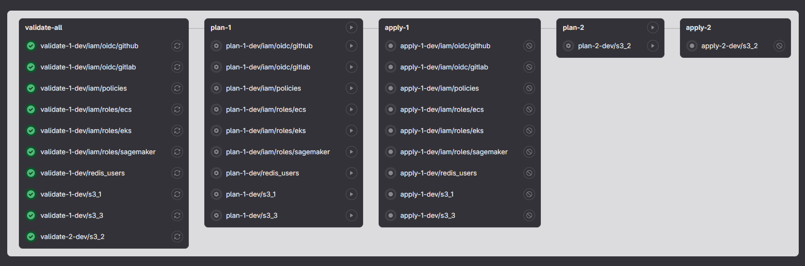
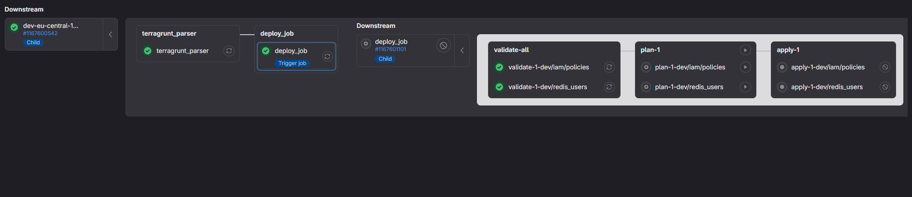

# Terragrunt parser for GitLab CI
Parse your Terragrunt configuration and create downstream pipelines with respect to dependencies, ordering and groups.

### Two ways supported:
 - Parse entire environment (i.e. dev) and create downstream pipeline. Ideal option for manual runs.
 Example in Gitlab for manual run is [here](https://gitlab.com/bee7ch/terragrunt-parser/-/pipelines/1167681087)
 
  
 - Get changed folders between two commits \ branches and generate downstream pipeline only for changed folders. Ideal option for Merge requests. Example in Gitlab for merge request is  [here](https://gitlab.com/bee7ch/terragrunt-parser/-/pipelines/1167684852)
 

### Keys features:
  - Specify different versions for Terraform and Terragrunt via cli options:
  
     `terragrunt_parser.py --tf-version 1.7.2 --tg-version v0.50.14`
  - Add custom before_script to downstream pipeline:
    
    ```
    terragrunt_parser.py \
      --image-version bee7ch/terragrunt-parser:0.0.47 \
      --before-script "eval \$(ssh-agent -s)" \
      --before-script 'ssh-add <(echo $GITHUB_SSH_KEY | base64 -d)' \
      --before-script "mkdir -p ~/.ssh" \
      --before-script "ssh-keyscan -v github.com >> ~/.ssh/known_hosts"
    ```
  - Specify `validate`, `plan` and `apply` jobs to run manually or automatically. By default only `validate` always runs.

    ```
    terragrunt_parser.py \
      --image-version bee7ch/terragrunt-parser:0.0.47 \
      --validate always \
      --plan always
    ```
  - Find changed folders between two commits \ branches and generate downstream pipeline:
    ```
    terragrunt_parser.py \
      --image-version bee7ch/terragrunt-parser:0.0.47 \
      --only-changed-folders "/path/to/git/repository" origin/feature/rds origin/main
    ```
  - All plans are saved as artifatcs and used in `apply` stages
  - Specify local file `terragrunt run-all init` output for debugging:
    ```
    terragrunt_parser.py --path local-terragrunt-run-all.output --out-path downstream-pipeline.yml
    ```
  - Pass variable `$DESTROY_ENABLED=true` to downstream pipeline to include `destroy` stage
  - Pass viarable `RUNNERS=my-runner-1,my-runner-2` to specify runners for downstream pipeline
  - To get all available options run `terragrunt_parser.py --help`

  [Examples for Gitlab CI is here](https://gitlab.com/bee7ch/terragrunt-parser)